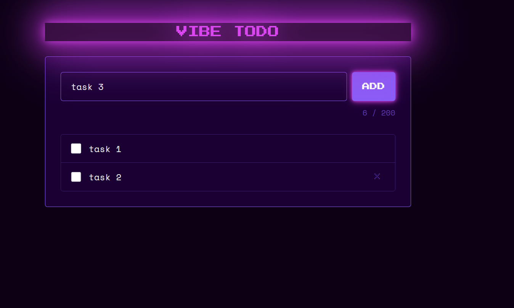

# UX Improvement – Vibe Todo

## Current UI Screenshot

## Context

The current UI (retro 80s neo-purple theme) has several usability issues identified from the existing implementation. This feature addresses visual polish and interaction quality improvements to the task list interface.

## Current State (reference: image.png)

- The app header "VIBE TODO" has an oversized neon glow effect that is visually too heavy.
- Task items display a checkbox and task label. On hover, a delete button (×) appears in the right side, but it is nearly invisible due to low contrast against the dark purple background.
- There is no creation date shown on task items.
- Tasks cannot be reordered; the list order is fixed after creation.
- Deleting a task is immediate with no confirmation step, making accidental deletions easy.

## Requirements

### 1. Fix Header Glow
- Reduce the size/spread of the neon glow effect on the "VIBE TODO" heading so it is tight and refined, consistent with the retro aesthetic but not overwhelming.

### 2. Display Created At Date on Task Items
- Each task item must show the date (and optionally time) it was created.
- The date should be displayed in a subtle style (smaller font, muted color) that does not compete with the task label.
- Format: human-readable, e.g. `Apr 23, 2026` or relative like `2 hours ago`.

### 3. Drag and Drop to Reorder Tasks
- Users must be able to reorder tasks via drag and drop within the task list.
- A visual drag handle (e.g. `⠿` or `≡` icon) should be shown on each task item to indicate draggability.
- The dragged item should have a clear visual active state (e.g. slight scale, shadow or opacity change).
- The new order must be persisted (local state / localStorage).

### 4. Improve Delete Button (×) Visibility
- The × delete button on task items must be clearly visible.
- It should have sufficient contrast against the dark background at all times (not only on hover or with opacity too low).
- Recommended: use a brighter or more saturated color for the icon, or add a subtle background/border on the button.

### 5. Delete Confirmation Dialog
- When the user clicks the × button to delete a task, a confirmation dialog must appear before the task is removed.
- The dialog should ask: *"Are you sure you want to delete this task?"* with **Confirm** and **Cancel** actions.
- The dialog must follow the existing retro neo-purple visual style.
- Pressing **Cancel** or clicking outside the dialog dismisses it without deleting the task.
- Pressing **Confirm** removes the task from the list.

## Design Constraints
- All changes must stay within the existing retro 80s neo-purple (dark background, purple/pink neon accents) design language.
- Tailwind CSS is the styling tool; no additional CSS frameworks should be introduced.
- Changes are purely front-end; no back-end or API changes are required.
